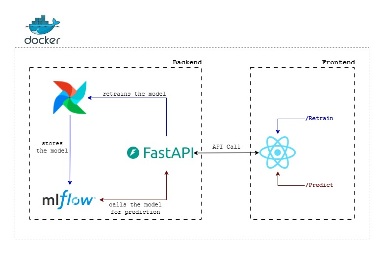

# MLOps Project

This repository contains the source code and resources for a project that implements Docker to containerize a simple MLOps pipeline.

## Architecture

The microservice architecture is composed of two main components the backend and the frontend. The former includes three services:

1. Model (Re)training Pipeline.
2. Model Deployment.
3. Model Inference.

The latter is exclusively focusing on triggering prediction generation and model (re)training. The architecture is designed to be modular, scalable, and efficient.



## Usage

To run this project, make sure you are in the root folder and use the following command:

```sh
docker compose up --build
```

This command will build and start all the services defined in the `compose.yaml` file, setting up the entire environment for the project.

## To Do

- [ ] Add unit tests for the backend
- [ ] Implement CI/CD pipeline
- [ ] Improve documentation
- [ ] Optimize Docker images
- [ ] Add more features for the retraining in the frontend
- [ ] Refactor code for better maintainability
